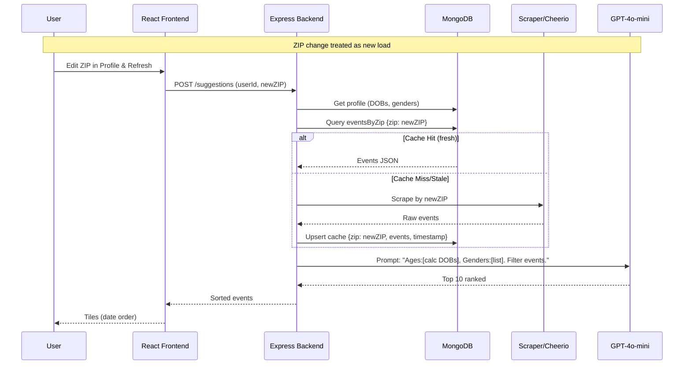

# Updated Requirements Document: KinQuest Family Events App

## 1. Introduction
### 1.1 Purpose
This updated document incorporates refinements to the functional and non-functional requirements for the KinQuest app. It focuses on a web application for discovering personalized, family-friendly local events in the USA via ZIP code-based scraping. Key updates: Expanded user profile for gender and other demographics; per-ZIP event caching for efficiency; ZIP changes trigger fresh suggestion loads; OpenAI model configurability.

### 1.2 Scope
- **In Scope**: Google OAuth, enhanced profile (DOB + gender), ZIP-based scraping with Cheerio, GPT-4o-mini LLM filtering, two-page UI, per-ZIP caching, on-demand personalization.
- **Out of Scope**: Mobile app, notifications, payments, real-time updates, non-USA support.
- **Assumptions**: Public sites scrapable; OpenAI API key in .env; Vercel deployment.

### 1.3 Target Users
- Families seeking age/gender-appropriate local events (e.g., kids' crafts, adult-inclusive fairs).

## 2. Functional Requirements
### 2.1 Authentication and Onboarding
- **FR-01**: Google OAuth authentication; first-time redirect to profile creation.
- **FR-02**: Profile form:
  - Auto-fill: Name, email from Google.
  - Required: ZIP code (5-digit USA, validated).
  - Family members (dynamic add/remove): Name, full DOB (YYYY-MM-DD for age calc), gender (M/F/Other/Prefer not to say, optional).
- **FR-03**: Securely store profile in MongoDB; block app access pre-completion.

### 2.2 Event Discovery and Suggestions
- **FR-04**: Suggestions page "Refresh" button triggers per-ZIP scrape (if cache stale) + personalization.
- **FR-05**: Scrape public sources (e.g., libraries, rec clubs) for next 30 days' events using Cheerio. Extract: title, date/time, location, description, age/gender hints, link.
- **FR-06**: Cache raw events per ZIP in MongoDB (24-hour TTL). On refresh: Fetch cache or scrape → Prompt GPT-4o-mini with profile (ages from DOB, genders) for filtering/ranking (e.g., "Filter for family: 5yo boy, 35yo woman; prioritize inclusive events"). Limit: 10 events.
- **FR-07**: Display as date-sorted tiles: Preview (title, date, snippet, icons for age/gender fit). Click: Detailed modal with full info, LLM rationale, external link.
- **FR-08**: Nav between Profile/Suggestions; ZIP edit in Profile re-triggers suggestions on next refresh (treat as new context).

### 2.3 Data Management
- **FR-09**: Generic per-ZIP event cache; user-specific filters applied on-demand.
- **FR-10**: Profile edits (e.g., add gender/DOB) allow refresh for re-personalization.

## 3. Non-Functional Requirements
### 3.1 Performance
- **NFR-01**: Load <3s; process <10s (caching aids this).
- **NFR-02**: Scale to 100 users via Vercel.

### 3.2 Security
- **NFR-03**: HTTPS; encrypt DOB/gender in MongoDB.
- **NFR-04**: Rate-limit scraping.
- **NFR-05**: Anonymize profile data in LLM prompts; CCPA compliance.

### 3.3 Usability
- **NFR-06**: Responsive, accessible UI.
- **NFR-07**: Handle no-matches: Show top generic events with note.

### 3.4 Reliability and Maintainability
- **NFR-08**: 99% uptime; tests for auth/scraping/LLM.
- **NFR-09**: Logs; .env for OPENAI_MODEL (default: gpt-4o-mini) and OPENAI_API_KEY.

## 4. Constraints and Dependencies
- **Constraints**: Plain JS; USA ZIPs; ethical scraping.
- **Dependencies**: Google OAuth, OpenAI SDK, Cheerio, MongoDB Atlas, Vercel.

---

# Updated Technical Architecture: KinQuest Family Events App

## Overview
Client-server setup: React frontend, Express.js backend. Updates: MongoDB confirmed; Cheerio for scraping; GPT-4o-mini via .env (OPENAI_MODEL, OPENAI_API_KEY); Vercel deploy; per-ZIP event cache in MongoDB; ZIP changes load new cache/filter; profile includes gender for LLM context.

### Tech Stack
- **Frontend**: React (v18+), plain JS, CRA. State: Context API. UI: Tailwind/CSS modules. Routing: React Router.
- **Backend**: Node.js (v20+), Express (v4+), plain JS. Auth: Passport Google. Scraping: Axios + Cheerio. LLM: OpenAI SDK (model from .env). DB: MongoDB/Mongoose (Atlas). Cache: MongoDB collections (eventsByZip).
- **Deployment**: Vercel (serverless functions for backend routes; static frontend hosting).
- **Other**: CORS; .env for keys; Jest tests.

### Key Components
- **Frontend**: AuthRedirect, ProfileForm (with gender dropdown), SuggestionsList (tiles), EventDetailModal.
- **Backend Routes**:
  - `/auth/google`: OAuth.
  - `/profile`: GET/POST/PUT (store DOBs, genders, ZIP).
  - `/suggestions`: POST (body: {userId, zip}); checks cache, scrapes if needed, filters via LLM, returns sorted JSON.
- **Services**:
  - ScraperService: Cheerio-parse URLs by ZIP (e.g., `library.site/events?zip=${zip}`).
  - CacheService: MongoDB upsert for eventsByZip {zip, events[], timestamp}.
  - LLMService: Prompt: "Family: [ages from DOBs, genders]. Events: [JSON]. Filter/rank top 10 suitable." Use GPT-4o-mini.
- **Data Flow**: Login → Profile save (with gender) → Refresh → Get ZIP cache or scrape → LLM personalize (ages/genders) → Sort dates → Render tiles. ZIP change: New cache fetch.

### Mermaid Diagram: High-Level Component Diagram
```mermaid
graph TD
    A[User Browser] -->|HTTPS| B[React Frontend on Vercel]
    B -->|Google OAuth| C[Express Backend on Vercel]
    C -->|Store Profile (DOB/Gender/ZIP)| D[MongoDB Atlas]
    B -->|Profile Edit| E[ProfileForm]
    E -->|Update| C
    B -->|Suggestions Nav| F[SuggestionsPage]
    F -->|Refresh| G[POST /suggestions]
    G -->|Check Cache by ZIP| H[eventsByZip Collection]
    H -->|Stale/Miss| I[ScraperService + Cheerio]
    I -->|Parse| J[Public Sites e.g., ?zip=90210]
    I -->|Raw Events| H
    G -->|Profile DOBs/Genders| K[LLMService GPT-4o-mini]
    K -->|Prompt from .env Model| L[OpenAI API]
    L -->|Filtered Events| G
    G -->|Sorted JSON| F
    F -->|Tile Click| M[EventDetailModal + Links]
    M -->|External| J
    style A fill:#f9f,stroke:#333
    style C fill:#bbf,stroke:#333
    style D fill:#dfd,stroke:#333
    style K fill:#fdb,stroke:#333
```

### Sequence Diagram for Suggestions Refresh (with ZIP Change Handling)


## Implementation Notes
- **.env Setup**: Add `OPENAI_API_KEY=sk-...` and `OPENAI_MODEL=gpt-4o-mini`.
- **ZIP Handling**: On ZIP update, invalidate user-specific views but reuse generic cache.
- **Expansion**: "Etc." in profile (e.g., interests) can be added later via optional fields.
- **Vercel Config**: Use `vercel.json` for routes; env vars via dashboard.